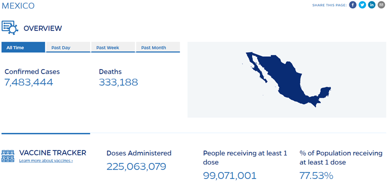

```{r setup, include=FALSE}

```

# Marco Teorico

## ¿Cuál es la situación actual de COVID-19 a nivel mundial, en México, en tu estado de origen y en tu municipio, alcaldía o colonia? Puedes iniciar tu búsqueda en el sitio de [Johns HopkinsLinks to an external site.](https://coronavirus.jhu.edu/map.html).

El estado de la pandemia de COVID-19 en la fecha 4/30/2023. Dentro del panorama mundial hay 676,609,955 casos de COVID-19, 6,881,955 de muertes. En México es de un total de casos COVID-19 de 7,483,444 con 333,1888 muertes por la enfermedad. Dentro de mi localidad, en el estado de Querétaro 191,063 de casos COVID-19 y 6,974 de muertos. Aunque en el municipio de Querétaro solo hay el dato de 125,169 casos COVID-19.




## ¿Cuál fue la primera variante del virus que se propagó a todo el mundo?

La primera variante de COVID-19 fue Alpha (B.1.1.7) según (Katella, 2023) "Alpha (B.1.1.7) was the first of the highly publicized variants. Alpha first appeared in Great Britain in November 2020 and infections surged in December of that year."

## ¿Cuáles son las otras variantes del virus que existen en otras regiones del mundo?

Hay una larga de lista de variantes del COVID-19 desde la mencionada Alpha (B.1.1.7). Según el artículo escrito por (Katella, 2023):

1.Omicron (BA.1)- Botswana and South Africa in 2021

2.Delta (B.1.617.2)-India a finales de 2020

3.Delta AY.4.2-Inglaterra

4.Beta (B.1.351)- South Africa

5.Alpha (B.1.1.7)-Inglaterra 2020

There is another table of variants in the CDC segun (CDC,2023) existen las siguientes variantes:

## ¿Cómo buscarías información de la variante del virus en tu país?

Para buscar información sobre la variante del virus en mi país, revisaría sitios oficiales del gobierno, como el de la Secretaría de Salud, que proporcionan información actualizada sobre COVID-19, incluyendo la propagación del virus y las variantes identificadas. También buscaría información en medios de comunicación locales, revistas y artículos científicos. Además, trataría de revisar lo que expertos en salud han declarado y seguir a organizaciones en redes sociales que estén brindando información confiable sobre la situación del virus en mi país y el mundo en general. Me aseguraría de verificar cualquier información que encuentre antes de compartirla con otros, para evitar difundir información falsa o engañosa.

## Imagina que te encuentras en una situación similar a la de Li Wenliang, médico chino que intentó alertar sobre el brote de coronavirus en su país, pero fue detenido por las autoridades y obligado a retractarse, ¿qué harías en su caso? Selecciona un inciso:a) Lo reportas al centro de investigación o la universidad. b) Lo reportas a la prensa. c) Guardas la información. Elige y justifica tu respuesta. Revisa el siguiente video como apoyo:

Lo reportaría a la prensa, creo que si yo fuera como Li un experto o profesional que tiene en sus manos información sensible, que si difundiera salvaría vidas la compartiría. Por que es mi vida por la de muchos mas, si me arrestaran por difundir la información o me mataran o desaparecieran seria mi vida por a ver alertado y por lo tanto salvado a muchos otros.

# Codigo

```{r}
library(ape)
library(gridExtra)
library(ggplot2)
library(stringr)
library(seqinr)
```

```{r}
lengthSeq <- function(dnaseq) {
  contador <- 0
  for (i in 1:length(dnaseq)) {
    contador <- contador + 1
  }
  return(contador)
}
```

```{r}
percentageGC <- function(dnaseq) {
  bases <- c("C", "G")
  c <- 0
  for(i in 1:length(bases)){
    contador <- 0
    for(j in 1:length(dnaseq)){
      if (bases [i] == dnaseq [j]){
        contador <- contador + 1
      }
    }
    amount <- contador*100/length(dnaseq)
    c <- amount + c    
  }
  print(paste0("GC : ", c, "%"))
}
```

```{r}
reverseSeq <- function(sequence) {
  n <- length(sequence)
  hebra_inv <- numeric(n)
  for(i in 1:n){
    hebra_inv[i] <- sequence[n-i+1]
  }
  return(hebra_inv)
}
```

```{r}
percentageBases <- function(dnaseq){
  bnum <- c(0, 0, 0, 0)
  for (i in 1:length(dnaseq)) {
    if (dnaseq[i] == "A") {
      bnum[1] <- bnum[1] + 1
    } else if (dnaseq[i] == "C") {
      bnum[2] <- bnum[2] + 1
    } else if (dnaseq[i] == "G") {
      bnum[3] <- bnum[3] + 1
    } else if (dnaseq[i] == "T") {
      bnum[4] <- bnum[4] + 1
    }
  }
  tot_b <- sum(bnum)
  porcentaje_bases <- c(0, 0, 0, 0)
  for (i in 1:length(bnum)) {
    porcentaje_bases[i] <- ((bnum[i] / tot_b) * 100)
  }
  return(porcentaje_bases)
}
```

```{r}
# Read Sequences and store it as a vector
# Strain Actual.txt
seq1 <- readLines("./secuenciasEvidencia1/Actual.txt", n = -1)[-1]
var1 <- paste(seq1, collapse = " ")
strainActual <- strsplit(var1, "")[[1]]
# Strain Alpha.txt
seq1 <- readLines("./secuenciasEvidencia1/Alpha.txt", n = -1)[-1]
var1 <- paste(seq1, collapse = " ")
strainAlpha <- strsplit(var1, "")[[1]]
# Strain Delta.txt
seq1 <- readLines("./secuenciasEvidencia1/Delta.txt", n = -1)[-1]
var1 <- paste(seq1, collapse = " ")
strainDelta <- strsplit(var1, "")[[1]]
# Strain Omicron.txt
seq1 <- readLines("./secuenciasEvidencia1/Omicron.txt", n = -1)[-1]
var1 <- paste(seq1, collapse = " ")
strainOmicron <- strsplit(var1, "")[[1]]
# Strain Wuhan.txt
seq1 <- readLines("./secuenciasEvidencia1/Wuhan.txt", n = -1)[-1]
var1 <- paste(seq1, collapse = " ")
strainWuhan <- strsplit(var1, "")[[1]]
```

```{r}
#strainActual
lengthActual <- lengthSeq(strainActual)
percentageGC_Actual <- percentageGC(strainActual)
percentageBasesActual <- percentageBases(strainActual)
reverseActual <- reverseSeq(strainActual)
print("strainActual")
strainActual
print(paste("Longitud de secuencia"))
lengthActual
print(paste("Porcentaje de GC en secuencia"))
percentageGC_Actual
print(paste("Porcentaje de Bases en secuencia"))
percentageBasesActual
print("Secuencia al reves")
print(reverseActual)
```

```{r}
#strainAlpha
lengthAlpha <- lengthSeq(strainAlpha)
percentageGC_Alpha <- percentageGC(strainAlpha)
percentageBasesAlpha <- percentageBases(strainAlpha)
reverseAlpha <- reverseSeq(strainAlpha)
print("strainAlpha")
strainAlpha
print(paste("Longitud de secuencia"))
lengthAlpha
print(paste("Porcentaje de GC en secuencia"))
percentageGC_Alpha
print(paste("Porcentaje de Bases en secuencia"))
percentageBasesAlpha
print("Secuencia al reves")
print(reverseAlpha)
```

```{r}
#strainDelta
lengthDelta <- lengthSeq(strainDelta)
percentageGC_Delta <- percentageGC(strainDelta)
percentageBasesDelta <- percentageBases(strainDelta)
reverseDelta <- reverseSeq(strainDelta)
print("strainDelta")
strainDelta
print(paste("Longitud de secuencia"))
lengthDelta
print(paste("Porcentaje de GC en secuencia"))
percentageGC_Delta
print(paste("Porcentaje de Bases en secuencia"))
percentageBasesDelta
print("Secuencia al reves")
print(reverseDelta)
```

```{r}
#strainOmicron
lengthOmicron <- lengthSeq(strainOmicron)
percentageGC_Omicron <- percentageGC(strainOmicron)
percentageBasesOmicron <- percentageBases(strainOmicron)
reverseOmicron <- reverseSeq(strainOmicron)
print("strainOmicron")
strainOmicron
print(paste("Longitud de secuencia"))
lengthOmicron
print(paste("Porcentaje de GC en secuencia"))
percentageGC_Omicron
print(paste("Porcentaje de Bases en secuencia"))
percentageBasesOmicron
print("Secuencia al reves")
print(reverseOmicron)
```

```{r}
#strainWuhan
lengthWuhan <- lengthSeq(strainWuhan)
percentageGC_Wuhan <- percentageGC(strainWuhan)
percentageBasesWuhan <- percentageBases(strainWuhan)
reverseWuhan <- reverseSeq(strainWuhan)
print("strainWuhan")
strainWuhan
print(paste("Longitud de secuencia"))
lengthWuhan
print(paste("Porcentaje de GC en secuencia"))
percentageGC_Wuhan
print(paste("Porcentaje de Bases en secuencia"))
percentageBasesWuhan
print("Secuencia al reves")
print(reverseWuhan)
```

```{r}
gwuhan = data.frame(
  bases = c("A", "C", "G", "T"),
  g1 = percentageBases(strainActual)
)

w <- ggplot(gwuhan, aes(x = bases, y = g1, fill = bases)) +
  geom_bar(data = gwuhan, aes(x = bases, y = g1, fill = "strainActual"), stat = "identity", position = "dodge") +
  labs(title = "Comparación de las bases de ADN de las variantes del virus",x = "Bases", y = "Frecuencia", fill = "") +
  scale_fill_manual(values = c("strainActual" = "black")) +
  theme_minimal()

galfa = data.frame(
  bases = c("A", "C", "G", "T"),
  g2 = percentageBases(strainAlpha)
)

a <- ggplot(galfa, aes(x = bases, y = g2, fill = bases)) +
  geom_bar(data = galfa, aes(x = bases, y = g2, fill = "strainAlpha"), stat = "identity", position = "dodge") +
  labs(title = "",x = "Bases", y = "Frecuencia", fill = "") +
  scale_fill_manual(values = c("strainAlpha" = "grey")) +
  theme_minimal()

gbeta = data.frame(
  bases = c("A", "C", "G", "T"),
  g3 = percentageBases(strainDelta)
)

b <- ggplot(gbeta, aes(x = bases, y = g3, fill = bases)) +
  geom_bar(data = gbeta, aes(x = bases, y = g3, fill = "strainDelta"), stat = "identity", position = "dodge") +
  labs(title = "",x = "Bases", y = "Frecuencia", fill = "") +
  scale_fill_manual(values = c("strainDelta" = "pink")) +
  theme_minimal()

gdelta = data.frame(
  bases = c("A", "C", "G", "T"),
  g4 = percentageBases(strainOmicron)
)
d <- ggplot(gdelta, aes(x = bases, y = g4, fill = bases)) +
  geom_bar(data = gdelta, aes(x = bases, y = g4, fill = "strainOmicron"), stat = "identity", position = "dodge") +
  labs(title = "",x = "Bases", y = "Frecuencia", fill = "") +
  scale_fill_manual(values = c("strainOmicron" = "purple")) +
  theme_minimal()

gdelta = data.frame(
  bases = c("A", "C", "G", "T"),
  g4 = percentageBases(strainWuhan)
)
f <- ggplot(gdelta, aes(x = bases, y = g4, fill = bases)) +
  geom_bar(data = gdelta, aes(x = bases, y = g4, fill = "strainWuhan"), stat = "identity", position = "dodge") +
  labs(title = "",x = "Bases", y = "Frecuencia", fill = "") +
  scale_fill_manual(values = c("strainWuhan" = "red")) +
  theme_minimal()

grid.arrange(w,a,b,d,f, ncol=2)

```

Las graficas muestran la comparacion de nuleotidos entre variantes, podemos notar que la adenina y timina en general son los que mashay dentro delas secuencia. pero en general no exite una diferencia que los haga ser distitnos entre variatnes de la enfermedad.

# Referencias
https://www.ncbi.nlm.nih.gov/
